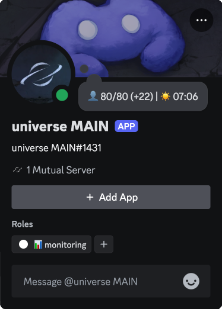

<div align="center">
   
   <br />
   <br />
   
   <br />
   <br />
</div>

# 🧟 DDM (dayz-discord-monitoring)
📊 A lightweight Go tool that launches multiple Discord bots to monitor DayZ servers, displaying server status, player numbers, and in-game time in Discord.

## 📝 Requirements

- **[Golang](https://go.dev/doc/install)** (version 1.24.4 or later)
- A **DayZ** server with accessible IP and port.
- **[Discord Developer Portal](https://discord.com/developers/applications)** bot tokens for each server you wish to monitor.

## ⚙️ Installation

1. Clone the repository:
```
git clone https://github.com/intejie/dayz-discord-monitoring.git
```

2. Install dependencies:
```
go mod download
```

3. Build the binary:
```
go build ./cmd/bots
```

## 🕹️ Usage

### 📄 Example config (`./config/config.example.yaml`)
```yaml
offline: "Server offline" # The name shown for the bot when the DayZ server is offline. This will be applied across all Discord guilds where the bot is present.

emojis:
  human: "👤" # Emoji representing human players; used to indicate the number of players online.
  day: "☀️" # Emoji indicating it's daytime in the DayZ server.
  night: "🌕" # Emoji indicating it's nighttime in the DayZ server.

bots:
- name: "Server #1" # The display name for this bot instance (max 32 characters).
  discord_token: "YOUR_DISCORD_BOT_TOKEN" # The Discord bot token from the Developer Portal.
  update_interval: 10 # How often (in seconds) the bot fetches data from the DayZ server and updates its status.
  server:
    ip: "127.0.0.1" # IP address of the DayZ game server to monitor.
    port: 2801 # Game port of the DayZ server.
    query_port: 2802 # Query port of the DayZ server (used to fetch server info).

- name: "Server #2" # Another bot instance monitoring a different server.
  discord_token: "YOUR_DISCORD_BOT_TOKEN"
  update_interval: 10
  server:
    ip: "127.0.0.2"
    port: 2802
    query_port: 2803

```

### 🚀 Launching the bots
Run the bot by specifying the path to your configuration file:
```bash
# Windows
bots.exe -config="path/to/config.yaml"

#Linux, MacOS
./bots -config="path/to/config.yaml"
```
